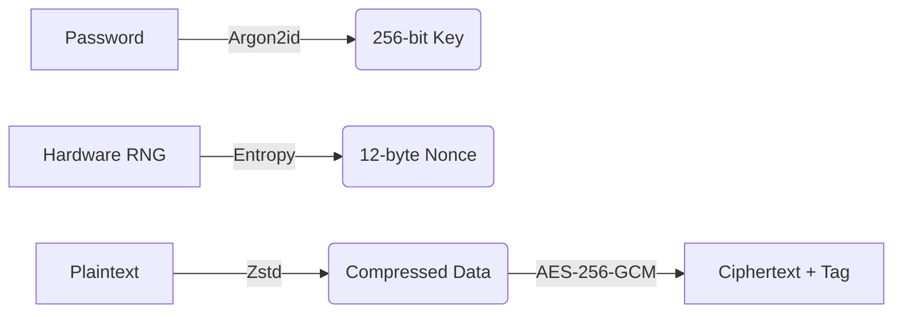

# True Random Encryption (TRE)

> **Next-Generation File Encryption with Hardware True-Randomness**

  

---

## Overview

**True Random Encryption (TRE)** is a defense-grade encryption utility designed for mission-critical data protection. Unlike standard tools that rely on pseudo-random number generators (PRNGs), TRE leverages **hardware entropy sources** (CPU thermal noise, RDRAND) to generate cryptographically secure keys.

Combined with **AES-256-GCM** authenticated encryption and **Argon2id** key derivation, TRE offers a security posture that exceeds industry standards.

---

## Key Capabilities

### Defense-Grade Security Architecture
- **Hardware Entropy:** Direct access to CPU thermal noise and RDRAND instructions.
- **Authenticated Encryption:** AES-256-GCM ensures both confidentiality and integrity.
- **Memory Hardening:** Argon2id KDF (64MB, 3 iterations) resists GPU/ASIC brute-force attacks.
- **Anti-Forensics:** Secure memory wiping (`sodium_memzero`) and constant-time comparisons.

### High-Performance Cryptographic Core
- **Hardware Acceleration:** Fully optimized for AES-NI instruction sets.
- **Smart Compression:** Integrated Zstandard (Zstd) with 4-tier adaptive compression.
- **Zero-Copy Architecture:** Streaming encryption for handling gigabyte-scale files with constant RAM usage.

### Enterprise-Grade Interface
- **Deep Tech GUI:** A modern, dark-mode interface designed for enterprise environments.
- **Drag & Drop:** Seamless workflow for rapid file processing.
- **Real-Time Feedback:** Visual strength indicators and progress monitoring.

---

## Quick Start

### Installation

```bash
# 1. Install Dependencies
sudo ./scripts/install_dependencies.sh

# 2. Build from Source
mkdir -p build && cd build
cmake ..
make

# 3. Launch
./tre-gui
```

---

## Usage Guide

### Graphical Interface
Launch the application to access the full suite of features in a visual environment:
```bash
./tre-gui
```

### Command Line Interface (CLI)

**Encrypt a file:**
```bash
./tre encrypt classified_doc.pdf
```

**Encrypt with Ultra Compression:**
```bash
./tre encrypt database.sql --compress-ultra
```

**Decrypt:**
```bash
./tre decrypt classified_doc.tre
```

---

## Technical Architecture

### Encryption Pipeline


### File Format Specification (V4)
| Header | Metadata | Salt | Nonce | Payload | Flag |
|--------|----------|------|-------|---------|------|
| 1 Byte | Ext Len  | 128B | 12B   | AES-GCM | Comp |

---

## Security Assurance

TRE is engineered with a **Security-First** philosophy:
1.  **No Backdoors:** Open-source and auditable.
2.  **No Weak Ciphers:** Only authenticated encryption (AEAD) is used.
3.  **No Timing Leaks:** Constant-time validation for all sensitive operations.

---

## Benchmarks

| Operation | Speed | Efficiency |
|-----------|-------|------------|
| Encryption | ~1.2 GB/s | AES-NI Optimized |
| Key Derivation | ~1.5s | Brute-Force Resistant |
| Compression | 40-50% | Zstd Algorithm |

---

## License

MIT License. Built for the Community.

